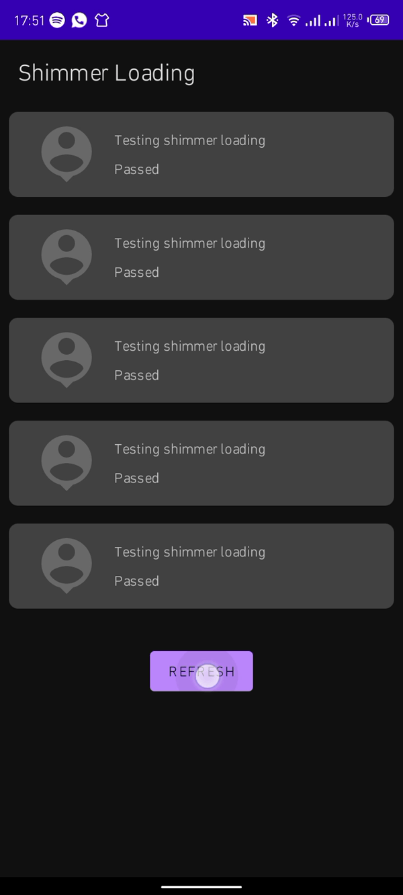

### Shimmer Loading Effect

This App demonstrates how shimmer can be used in Android.

### Tech-stack

1. [Kotlin](https://developer.android.com/kotlin) - A statically typed programming language.
2. [Coroutines](https://developer.android.com/kotlin/coroutines) - Lightweight concurrency design pattern used to run background and timely jobs.
3. [Shimmer Loading](https://github.com/facebook/shimmer-android) - A smartly animated loading indicator.



### Usage

This repo can be used by doing either of the following:
- run 

`for SSH users`
```shell script
$ git clone git@github.com:Ericgacoki/shimmer-loading-effect
```

`for HTTPS users`

```shell script
$ git clone https://github.com/Ericgacoki/shimmer-loading-effect
```

### Feel free to raise an issue or create a `PR` if need be. 😎


